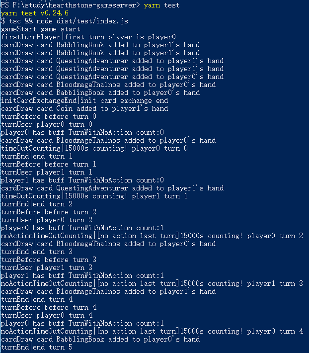

# hearth stone game server

a game server for hearth stone based on Event

## usage

```
import Game from '../Game'

const game = new Game()
game.addListener('notify', (data) => {
  console.log(`${data.type}|${data.message}`)
})
game.start()
```



## a lot work to do

- Minions
- Spells
- Weapons
- more Heros and Hero Skills
- UI 